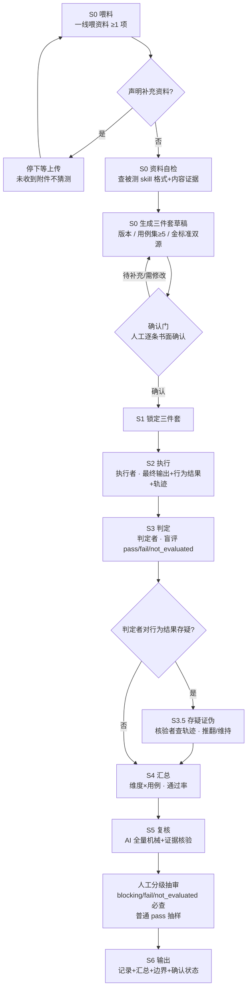

# SOP 总览（skill-accuracy-eval）

> 本文件是评测 skill 的完整操作流程（SOP）速查版，与 SKILL.md / evaluation-framework.md 共用同一套结论、范围和纪律；角色分离、fail-closed、双源金标准均为硬约束。

## 一、全流程一览

| 阶段 | 角色 | 做什么 | 产出 | 闸门 / 纪律 |
|---|---|---|---|---|
| **S0 喂料** | 一线 | 喂资料：技能说明 / 业务规则 / 用户问题样例 / 禁止行为 / 真实数据 / 字段字典（≥1 项，越多越准） | 资料清单 | 声明"要补充资料"→ **立即停下等上传**，未收到附件不猜测不代拟 |
| **S0 资料自检** | 评测 AI | 只查**被测 skill 本身**：格式（frontmatter / 要素 / 版本 / 体积分层）+ 内容证据（断言 / 边界 / 示例 / 字段一致性） | 体检摘要 | 缺口标"建议补齐"不阻断；**不代写内容**；有字典必须做字段比对 |
| **S0 生成草稿** | 评测 AI | 生成三件套草稿：被测版本 / 用例集（≥5，反例 ≥1/3）/ 金标准（**双源**） | 三件套草稿 | 业务正确性只从业务来源抽；行为契约标"技能契约"；冲突业务优先 |
| **S0 确认门** | 人工 | 逐条显式回执：可接受 / 需修改 / 待补充 | **金标准确认记录**（书面：每条 × 状态 × 人 × 日期） | 补充资料 ≠ 确认，补后必须回到确认门；未确认 → 结论"草稿级" |
| **S1 锁定** | 人工 | 锁定三件套 + 用例编号 + 来源标注 | 锁定版三件套 | 未锁定（含未确认项）→ 不进入 S2 |
| **S2 执行** | **执行者**（subagent） | 真实环境逐用例跑，只采集最终输出 + 关键行为结果 | 证据：输出 + 行为结果 + **执行轨迹**（含 case_id） | 不采集、不分析轨迹中间步骤 |
| **S3 判定** | **判定者**（subagent） | 逐用例 × 三维度盲评 `pass / fail / not_evaluated` + 引用条款理由 | 判定记录 | 盲评不看轨迹；fail-closed；blocking fail → 整例 fail；可选多视角专家 |
| **S3.5 存疑证伪** | **核验者**（subagent） | 判定者对行为结果存疑 → 查对应轨迹对账 | 推翻 / 维持 + 证据 | **仅可否决、不可授分**；不重新打分 |
| **S4 汇总** | 评测 AI | 维度 × 用例打分表，通过率 = pass / (pass+fail) | 汇总表 | 不合成单一总分；not_evaluated 单列 |
| **S5 AI 复核** | **复核者**（subagent） | 机械一致性 + 证据真实性（轨迹对账）全量核验 | 复核清单勾选 + 未签认项 | 独立于执行 / 判定；**不下新 verdict** |
| **S5 人工抽审** | 人工 | blocking fail / fail / not_evaluated **必查**；普通 pass 抽样（比例写入记录，金额 / 权限 / 隐私优先） | **人工抽审记录** | 未抽审部分以 AI 复核为准；**放行是人的决策** |
| **S6 输出** | 评测 AI | 评测记录 + 维度汇总 + 边界说明 + 金标准确认状态 | 最终报告 | 版本锁定（铁律 6）；**不判生死**（铁律 3） |

## 二、角色体系（subagent）

| 角色 | 何时 | 输入 | 产出 | 分离约束 |
|---|---|---|---|---|
| 执行者 | S2 | 用例输入 + 被测 skill | 最终输出 + 关键行为结果 + 执行轨迹（命名含 case_id） | 不参与判定，不改金标准 |
| 判定者 | S3 | 证据包 + 金标准 | 逐用例 × 维度 verdict + 引用条款的理由 | 盲评：不看执行过程与轨迹全文 |
| 核验者 | S3.5（判定者存疑时） | 存疑条目 + 对应轨迹 | 推翻 / 维持 + 证据 | 只看指定轨迹片段，不重新打分 |
| 多视角专家（可选） | S3 | 最终输出 + 金标准 | 各视角独立判定 + 一致 / 分歧结论 | 相互隔离，不共享草稿 |
| 复核者 | S5 | 判定记录 + 证据包 + 金标准确认记录 | 复核清单勾选结果 + 未签认项清单 | 独立于执行 / 判定；只核验，不下新 verdict |
| 人工 | 确认门 / S5 | 复核报告 + 抽审项 | 金标准书面确认 / 抽审签认 / 放行 | 抽查模式；复核放行是人的决策 |

角色顺序闭环：执行者（S2）→ 判定者（S3 盲评）→（存疑时）核验者（S3.5）→ 复核者（S5 AI 全量）→ 人工抽审签认（S5）→ 输出（S6）。不支持 subagent 时降级：单人依次切换身份，报告标注"单人自评，角色由同一人依次承担"。

## 三、流程全景（Mermaid）

## 四、三条贯穿主线的硬约束

1. **角色分离**：执行者 → 判定者 → 核验者 → 复核者默认不得同一执行单元兼任；不支持 subagent → 单人依次切换身份，报告标注"单人自评，角色由同一人依次承担"。
2. **证据链**：每条判定 = 用例 + 输入 + 最终输出原文 + 关键行为结果 + 判定理由（引用条款）——另一个不看轨迹的人也能复核。
3. **fail-closed + 双源**：缺证据一律 not_evaluated 不猜 pass；金标准业务正确性只认业务方书面确认，技能契约仅证言行一致、冲突时业务优先。

## 五、结论模板（S6）

> 在 {N} 个用例（被测版本 {v}，评测日期 {d}）上：
> 结果正确性 X/N 通过，规则与边界 Y/N 通过，可靠与兜底 Z/N 通过；
> 其中 {M} 例阻断性失败（违反……，见逐条记录）。
> 本结论仅覆盖该版本与这些用例，不扩展为对全部业务输入的可靠性承诺。

## 六、七条硬纪律（违反即评测作废）

1. **业务正确性金标准来自业务，不照抄 Skill 自己的步骤**——否则会奖励对错误流程的忠实执行；行为契约类可抽自 skill 自身声明，仅证明言行一致，冲突时业务优先。
2. **fail-closed**：缺证据一律 `not_evaluated`，绝不补默认分、不猜 pass。
3. **不判生死**：只出"分数 + 证据"，永不输出"建议保留 / 回滚"。
4. **分维度独立表达**，不生成跨维度单一总分。
5. **样本边界**：少量样本的好结果只表述为"在这些条件和样本中通过"，不扩展为全体可靠性承诺。
6. **版本锁定**：结论必须带上被测 Skill 版本与用例版本；无版本不产结论。
7. **对比只改一类变量**：改前改后对比时，用例、环境不变，只换被测版本。
