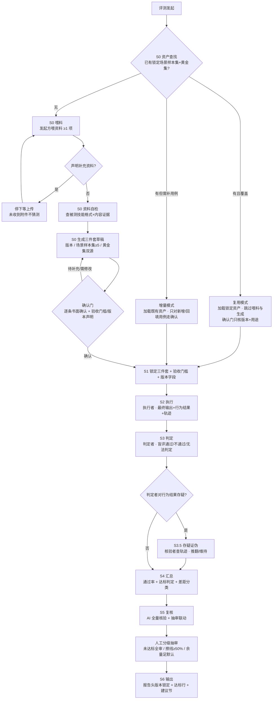

# SOP 总览（skill-accuracy-eval）

> 本文件是评测技能的完整操作流程（SOP）速查版，与 SKILL.md / evaluation-framework.md 共用同一套结论、范围和纪律；角色分离、缺证从严、双源黄金集均为硬约束。
>
> 配套视觉图（一屏速览）：`assets/sop-overview-graphic/sop-overview.png`（HTML 源文件同目录 `sop-overview.html`）。术语与完整资料参考页：同目录 `terms-and-docs.html`（v1.5 术语统一 + 全资料速查）。

## 一、全流程一览

| 阶段 | 角色 | 做什么 | 产出 | 闸门 / 纪律 |
|---|---|---|---|---|
| **S0 资产查找**（v1.5） | 评测 AI | 先查是否已有本被测技能的**锁定评测资产**（场景样本集 + 黄金集，带版本）；有且覆盖 → **复用模式**（加载锁定资产，跳过喂料与生成）；无 → **生成模式**；需补用例 → **增量模式**（加载既有资产 + 只对新增/回填用例走确认） | 复用确认 / 生成起点 | 复用 ≠ 免确认：确认门只核版本 + 用途；资产不适用（业务资料 / 黄金集变更）→ 回生成模式或先升级资产，被测版本变化不触发资产重建 |
| **S0 喂料** | 发起方 | 喂资料：技能说明 / 业务规则 / 用户问题样例 / 禁止行为 / 真实数据 / 字段字典（≥1 项，越多越准） | 资料清单 | 声明"要补充资料"→ **立即停下等上传**，未收到附件不猜测不代拟 |
| **S0 资料自检** | 评测 AI | 只查**被测技能本身**：格式（文档头 / 要素 / 版本 / 体积分层）+ 内容证据（断言 / 边界 / 示例 / 字段一致性 / 术语一致性） | 体检摘要 | 缺口标"建议补齐"不阻断；**不代写内容**；有字典必须做字段比对 |
| **S0 生成草稿** | 评测 AI | 生成三件套草稿：被测版本 / 场景样本集（≥5，反例 ≥1/3）/ 黄金集（**双源**） | 三件套草稿 | 业务正确性只从业务来源抽；行为契约标"技能契约"；冲突业务优先 |
| **S0 确认门** | 人工 | 逐条显式回执：可接受 / 需修改 / 待补充；可一并声明**分维度验收门槛**（多人讨论 + 确认记录）与**版本字段** | **黄金集确认记录** + **验收门槛确认记录**（如有） | 补充资料 ≠ 确认，补后必须回到确认门；未声明验收门槛不做达标判定；仅契约一致性须显式声明 |
| **S1 锁定** | 人工 | 锁定三件套 + 用例编号 + 来源标注 | 锁定版三件套 | 未锁定（含未确认项）→ 不进入 S2 |
| **S2 执行** | **执行者**（子智能体） | 真实环境逐用例跑，只采集最终输出 + 关键行为结果 | 证据：输出 + 行为结果 + **执行轨迹**（含用例编号） | 盲评前不分析轨迹中间步骤；执行者仍留执行轨迹 |
| **S3 判定** | **判定者**（子智能体） | 逐用例 × 三维度盲评 `通过 / 不通过 / 无法判定` + 引用条款理由 | 判定记录 | 盲评不看轨迹；过程类条款需独立可观察证据，缺证记 `无法判定`；缺证从严；阻断性失败 → 整例不通过；可选多视角专家 |
| **S3.5 存疑证伪** | **核验者**（子智能体） | 判定者对行为结果存疑 → 查对应轨迹对账 | 推翻 / 维持 + 证据 | **仅可否决、不可授分**；不重新打分 |
| **S4 汇总** | 评测 AI | 维度 × 用例打分表（按失败用例计数，同例多条断言不重复计例），通过率 = 通过 / (通过+不通过)；有验收门槛 → **达标判定**（数值比较 / 覆盖状态 / 阻断结果三字段分开）+ **差距分类** + **改进建议** | 汇总表 + 达标行 | 不合成单一总分；无法判定单列；阻断性一票否决；无业务黄金集的维度禁判；覆盖不足标记"覆盖不足、仅参考" |
| **S5 AI 复核** | **复核者**（子智能体） | 机械一致性 + 证据真实性（轨迹对账）全量核验 | 复核清单勾选 + 未签认项 | 独立于执行 / 判定；**不下新判定** |
| **S5 人工抽审** | 人工 | 阻断性失败 / 不通过 / 无法判定 **必查**；普通通过抽样（比例写入记录，金额 / 权限 / 隐私优先）；**抽审联动**：未达标全审 / 擦线 ≥50% / 余量足默认 | **人工抽审记录** | 未抽审部分以 AI 复核为准；**放行是人的决策** |
| **S6 输出** | 评测 AI | 评测记录 + 维度汇总 + 达标行（如有）+ 差距分类 + 改进建议 + 黄金集确认状态 | 最终报告（头带版本锁定字段） | 版本锁定（铁律 6）；**不裁决但必给建议**（铁律 3）；仅契约一致性带边界声明 |

## 二、角色体系（子智能体）

| 角色 | 何时 | 输入 | 产出 | 分离约束 |
|---|---|---|---|---|
| 执行者 | S2 | 用例输入 + 被测技能 | 最终输出 + 关键行为结果 + 执行轨迹（命名含用例编号） | 不参与判定，不改黄金集 |
| 判定者 | S3 | 证据包 + 黄金集 | 逐用例 × 维度判定 + 引用条款的理由 | 盲评：不看执行过程与轨迹全文 |
| 核验者 | S3.5（判定者存疑时） | 存疑条目 + 对应轨迹 | 推翻 / 维持 + 证据 | 只看指定轨迹片段，不重新打分 |
| 多视角专家（可选） | S3 | 最终输出 + 黄金集 | 各视角独立判定 + 一致 / 分歧结论 | 相互隔离，不共享草稿 |
| 复核者 | S5 | 判定记录 + 证据包 + 黄金集确认记录 | 复核清单勾选结果 + 未签认项清单 | 独立于执行 / 判定；只核验，不下新判定 |
| 人工 | 确认门 / S5 | 复核报告 + 抽审项 | 黄金集书面确认 / 抽审签认 / 放行 | 抽审模式；复核放行是人的决策 |

角色顺序闭环：执行者（S2）→ 判定者（S3 盲评）→（存疑时）核验者（S3.5）→ 复核者（S5 AI 全量）→ 人工抽审签认（S5）→ 输出（S6）。不支持子智能体时降级：单人依次切换身份，报告标注"单人自评，角色由同一人依次承担"。

## 三、流程全景（Mermaid）

## 四、三条贯穿主线的硬约束

1. **角色分离**：执行者 → 判定者 → 核验者 → 复核者默认不得同一执行单元兼任；不支持子智能体 → 单人依次切换身份，报告标注"单人自评，角色由同一人依次承担"。
2. **证据链**：每条判定 = 用例 + 输入 + 最终输出原文 + 关键行为结果 + 判定理由（引用条款）——另一个不看轨迹的人也能复核。
3. **缺证从严 + 双源**：缺证据一律无法判定不猜通过；黄金集业务正确性只认业务方书面确认，技能契约仅证言行一致、冲突时业务优先。

## 五、结论模板（S6）

> 在 {N} 个用例（被测版本 {v}，评测日期 {d}）上：
> 结果正确性 X/N 通过，规则与边界 Y/N 通过，可靠与兜底 Z/N 通过；
> 其中 {M} 例阻断性失败（违反……，见逐条记录）。
> 本结论仅覆盖该版本与这些用例，不扩展为对全部业务输入的可靠性承诺。

> **有声明验收门槛时追加**：达标判定：结果正确性 {实测} vs 验收门槛 {P%} → 达标 / 未达标（差 Q 个百分点）；规则与边界 …；可靠与兜底 …；差距分类：不通过集中于 {维度 × 场景 × 条款}；改进建议见建议节。
> **版本锁定**：业务资料 vX / 黄金集 GS-… / 运行环境 …，至 YYYY-MM-DD 有效；任一版本变更需重评。
> **仅契约一致性**：报告头尾带"本评测仅契约一致性，不构成业务正确性达标"。

## 六、七条硬纪律（违反即评测作废）

1. **业务正确性黄金集来自业务，不照抄技能自己的步骤**——否则会奖励对错误流程的忠实执行；行为契约类可抽自技能自身声明，仅证明言行一致，冲突时业务优先；**无业务黄金集的维度禁止达标判定**（仅契约一致性，报告头尾声明边界）。
2. **缺证从严**：缺证据一律 `无法判定`，绝不补默认分、不猜通过。
3. **不裁决但必给建议**：不下"保留 / 回滚"放行裁决（那是人的决策）；必给改进建议（不通过类型 → 模板 + AI 润色，指向"怎么改"）。
4. **分维度独立表达**，不生成跨维度单一总分。
5. **样本边界**：少量样本的好结果只表述为"在这些条件和样本中通过"，不扩展为全体可靠性承诺。
6. **版本锁定**：结论必须带上被测技能版本与用例版本；无版本不产结论。
7. **对比只改一类变量**：改前改后对比时，用例、环境不变，只换被测版本。

## 七、达标判定与改进建议（速查）

| 项 | 规则 |
|---|---|
| 触发条件 | 确认门锁定过**验收门槛声明**（多人讨论 + 确认记录，模板 `assets/threshold-approval-template.md`）；未声明 → 只出分数与证据 |
| 判定 | 逐维度 实测通过率 vs 验收门槛 → 达标 / 未达标 + 差距 |
| 阻断性一票否决 | 任一阻断性失败 → 该维度未达标，即使通过率达标 |
| 防稀释 | 无法判定占比 > 声明上限（上限默认 10%）→ 降级"覆盖不足、仅参考" |
| 禁判 | 无业务黄金集维度 → 禁判（仅契约一致性，报告头尾边界声明） |
| 差距分类 | 不通过归集到 维度 × 场景分类（3 大类 19 子类）× 黄金集条款 |
| 建议 | 不通过类型 → 建议模板 + AI 润色；不下放行 / 回滚裁决 |
| 版本绑定 | 报告头 4 字段（业务资料 / 黄金集 / 运行环境 / 结论有效期）；任一变更旧结论失效 |
| 抽审联动 | 未达标全审 / 擦线（<5%）≥50% / 余量足默认 ≥20% |
| fork | 通用内核 fork 专用技能：声明 base-kernel-version，不可变条款禁改，强合规加"过程合规"维度 |

## 八、覆盖度与黄金集要点（速查）

| 项 | 规则 |
|---|---|
| 场景分类 | 场景样本集 / 黄金集统一 **3 大类 19 子类**（功能 5 / 非功能 5（含故障降级兜底）/ 对抗 9）；用例字段 = id / category / subcategory / input / expected_behavior / difficulty |
| 覆盖度清单化 | 业务场景枚举 + 19 子类显式勾选 + 维度覆盖适用表（必测 / 观察 / 不适用，确认门冻结）；必测子类缺勾选且未声明不适用 → 对应维度降级"覆盖不足、仅参考"，观察项缺 → 仅提示 |
| 分类标注形态 | 功能类 → 标准输出+依据；边界类 → 行为方向+边界判定依据；对抗类 → 按业务底线界定违规行为（阻断性）+ 拒绝理由充分性（质量观察项；不编造、忽略注入并继续授权任务等合法响应可按条款通过） |
| 专家点评 | 每条黄金集附评分尺度解释，供判定校准与报告引用 |
| 归因拆分 | 不通过 / 无法判定分流 skill_behavior（可回填）/ judge_bias（先改口径不回填）/ unknown（补证据）；防基准污染 |
| 问题回填升级 | 问题用例 → 补四要素 → 升级黄金集 → 纳入回归（对抗类按业务底线界定实际违规行为，阻断性单列门禁；不编造 / 忽略注入并继续授权任务可为合法通过）；仅 skill_behavior 可回填 |
| 覆盖盲区提示 | 黄金集全过 + 存在风险信号 → 提示"全过仅证明没崩，建议补样本"，不因全过断言足够好 |
| 样本量分级 | <30 → 结论收紧"仅参考、不具统计显著性"；≥30 常规表述；≥5 仅最低验收门槛 |
