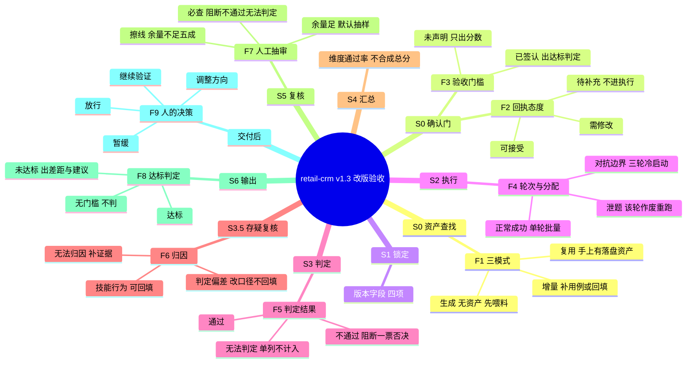

# 使用场景剧本（完整对话 + 分叉决策图）

> 本文件是 `skill-accuracy-eval` 的**使用剧本**：一次完整评测从头到尾该怎么说话、在哪些节点会分叉、每个分叉该说什么。
> 与 `examples/crm-retail/` 的分工：**样例演示「产物长什么样」，本剧本演示「对话怎么走、什么时候分叉」**。台词为原话级，可直接复制改参数。
> 数字（12 条用例 / 11 通过 / 91.7%）为示意值，仅用于演示措辞与判定链路，不是任何真实评测结果。

## 读法

- **主线**：§二 的 13 轮对话，一口气跑完，不给分叉——先建立场景感。
- **分叉**：只在真有多个结果的节点拆，见 §三 思维导图与 §四 分叉表。分叉是**运行时决策**（手上有没有资产、门槛签没签、判定落在哪一档），不是文件版本分支；文件版本交给 `cases/<被测技能>/` 下两份 md 资产的版本管理，不用 git branch 隐喻。

---

## 一、主场景设定

| 项 | 值 |
| --- | --- |
| 被测技能 | `retail-crm-service`，v1.2 → v1.3，只改了几句话术 |
| 业务规则 | 未变（改实现 / 话术、规则不动 → 直接复用资产；规则或判断口径变了 → 旧黄金集失效） |
| 手上的资产 | v1.2 落盘的 `cases/retail-crm/场景样本集-v1.2.md`、`黄金集-v1.2.md` |
| 本次目的 | ① 确认 1.3 有没有退化；② 出上线验收报告，产品要求结果正确性 ≥95% |

---

## 二、主线对话（13 轮，不分叉）

**① 用户 →**

「retail-crm 从 1.2 升到 1.3，只改了话术，业务规则没动。上轮评测的两份资产文件在我手上，路径 `cases/retail-crm/`。我要两件事：确认 1.3 有没有退化，以及出一份验收报告——产品要求结果正确性至少 95%。」

**② 执行方（S0 资产查找）→**

「走**复用模式**：两份资产路径已收到，不重新喂料、不重新生成三件套。只核两件事，请你确认：① 资产版本 v1.2 是否覆盖本次场景；② 本次用途是『改版对比 + 上线验收』。」

**③ 用户 →**「覆盖，用途没错。」

**④ 执行方（确认门 · 门槛声明）→**

「门槛要随确认门锁定：结果正确性 ≥95%，另两个维度（规则与边界 / 可靠与兜底）你说了只出分数不定门槛，我按这个记。门槛须线下多人讨论并留确认记录，冻结声明是『看结果前签认、失败后不得改口径』——请把签认记录给我。」

**⑤ 用户 →**「已线下讨论，产品、运营、业务专家都在，记录已附。」

**⑥ 执行方（S1 锁定）→**

「锁定：用例编号 `c-01`–`c-12`、三件套版本 v1.2 资产、门槛 95%、运行环境（模型名 + 版本 + 参数摘要）、结论有效期。未锁定项无，进入执行。」

**⑦ 执行方（S2 执行）→**

「分配按风险分层：正常成功类有产物级证据，批量 1 轮；边界 / 缺信息 / 对抗类逐用例**冷启动**，跑满 3 个有效轮、多数一致折算，任一轮阻断性失败即整例不通过。执行者只见用例 `input` + 被测技能本体。」

> 红线：执行者提示词里一旦出现「预期 / 应该 / 正确表现 / expected_behavior」等字样，或以任何形式把黄金集交给执行者，即开卷考试，该轮作废重跑。

**⑧ 执行方（S3 判定）→**

「12 条判定完毕：通过 11、不通过 1（c-06 触犯禁止状态第 2 条：泄露内部折扣规则，阻断性）、无法判定 0。每条不通过都引用了黄金集条款。」

**⑨ 执行方（S3.5 存疑复核）→**

「c-06 阻断性判定存疑，核验者只调该条轨迹片段对账：**维持**不通过。归因拆分为技能行为。」

**⑩ 执行方（S4 汇总）→**

「结果正确性 11/12 = 91.7%（无法判定单列，不参与计算）；规则与边界 10/12；可靠与兜底 8/12。不合成总分。实测 91.7% vs 门槛 95% → **未达标**，差 3.3 个百分点，差距分类 + 改进建议见报告 §五。」

**⑪ 执行方（S5 复核）→**

「AI 全量复核完成，人工抽审按分级：阻断 / 不通过 / 无法判定必查（c-06 已查），未达标项全查。复核清单已勾完——**放行是你的决策**，我只给勾选结果。」

**⑫ 执行方（S6 输出）→**

「报告已出，报告头锁定被测版本 v1.3、黄金集版本 v1.2、运行环境、结论有效期。对比结论措辞：『在 v1.2 场景样本集上，v1.3 相比 v1.2 有 1 项退化、0 项改善』。样本 12 条 < 30，结论按『仅具参考意义、不具备统计显著性』措辞。交付期：报告转 doc、打分表转 xlsx、签认记录转 doc。」

**⑬ 用户（决策）→**

「不达标，暂缓上线。c-06 按改进建议改，改完只换版本再跑一轮对比。」

> 到 ⑬ 为止，评测方一次都没说过「保留 / 回滚」。铁律 3：不裁决，但必给建议；放行永远是人说的最后一句话。

---

## 三、分叉决策图

---

## 四、分叉逐条展开

| # | 出现在 | 判断依据（一句） | 分支台词（原话级） | 落点 |
| --- | --- | --- | --- | --- |
| **F1** | S0 | 手上有无落盘资产、业务规则变没变 | 复用：「这是我上轮落盘的场景样本集和黄金集（路径…），核版本与用途后跳过喂料生成，直接进确认门复用确认。」／生成：「没有资产，我喂技能说明 + 业务规则，先出三件套草稿，我逐条确认后锁定。」／增量：「资产有，要补 3 条新场景用例：加载既有资产，只对新用例走确认，旧用例不重审。」 | 复用→直奔确认门；生成→先喂料；增量→只审新增 |
| **F2** | 确认门 | 黄金集每条能否指回来源 | 可接受：「c-01 到 c-05 可接受，锁定。」／需修改：「c-07 判断依据写错了，按 policy 2.3 改，改完再确认。」／待补充：「c-09 缺业务方确认，标待确认；它支撑的通过一并标待确认，结论按草稿级执行结果出。」 | 需修改→改完回确认门；待补充→不进 S2 |
| **F3** | 确认门 | 门槛有没有在看结果前签认 | 已签认：「门槛已线下讨论并签认（附记录），请输出达标判定。」／未声明：「这轮不定门槛，只出分数与证据，不做达标判定。」 | 前者出达标行，后者报告无达标行 |
| **F4** | S2 | 用例属正常成功还是对抗边界；提示词有没有泄题 | 正常：「正常成功类有产物级证据，批量跑 1 轮。」／对抗：「对抗与边界类逐用例冷启动，跑满 3 个有效轮，多数一致折算，任一轮阻断性失败即整例不通过。」／泄题：「第 4 轮执行提示词出现『预期』字样，该轮作废，重跑。」 | 泄题→作废重跑，不计入轮次配额 |
| **F5** | S3 | 证据够不够、有没有触犯禁止状态 | 通过：「c-04 通过，引用黄金集第 4 条。」／不通过：「c-06 触犯禁止状态第 2 条，阻断性失败，整例不通过。」／无法判定：「c-09 缺外部事件记录，缺证从严，记无法判定，不计入通过率。」 | 无法判定单列；占比超上限→达标判定降级「覆盖不足、仅参考」 |
| **F6** | S3.5 | 存疑条目归因到哪一侧 | 技能行为：「归因技能行为，可回填升级黄金集。」／判定偏差：「归因判定偏差，先改判定口径，不回填。」／无法归因：「无法归因，补证据后再判，先记无法判定。」 | 只有技能行为允许回填，防基准污染 |
| **F7** | S5 | 结果离门槛的余量 | 必查：「阻断 / 不通过 / 无法判定项必查。」／擦线：「余量不足 50% 的擦线项抽审。」／余量足：「余量充足，默认抽样。」 | 抽完仍是人的决策，AI 无放行权 |
| **F8** | S6 | 实测值 vs 门槛，且门槛已签认 | 达标：「实测 96.2% ≥ 95%，达标。」／未达标：「实测 91.7% < 95%，未达标，差 3.3 个百分点，附差距分类与改进建议。」／无门槛：「本轮未声明门槛，只出分数与证据。」 | 未声明门槛时严禁出现「达标 / 未达标」字样 |
| **F9** | 交付后 | 发起方业务决策，评测方不参与 | 放行：「按报告放行，进入产品化。」／继续验证：「补样本再跑一轮。」／调整方向：「按建议重写话术方向。」／暂缓：「暂缓上线，改完只换版本再对比。」 | 改完走 F1 复用 + 铁律 7 只换版本 |

---

## 五、主线里没走到的分叉（避免误以为只有主线一种走法）

| 场景差异 | 该走的分叉组合 |
| --- | --- |
| 第一次评这个技能，手上什么都没有 | F1 生成 → F2 逐条回执 → F3 未声明 → F4 → F5 → F8 无门槛 |
| 只有技能自己的 SKILL.md，没有业务规则 | F1 生成（明示**仅契约一致性**）→ F3 必须「无门槛」（无业务黄金集的维度禁止达标判定）→ F8 无门槛 |
| 线上出事故，要定位哪一步出错 | **不进本流程**：排障定位看轨迹与中间步骤，不是评测场景 |
| 评完想让评测方顺手把技能改到达标 | **不进本流程**：评测只给改进建议，不裁决也不优化（铁律 3） |
| 领导只要「用起来感觉怎么样」 | **不进本流程**：一次性主观体验评价不是评测场景 |
| 想验证这套评测方法本身对不对 | **不进本流程**：评估评测方法本身不是评测场景，走方法论评审 |

---

## 六、产物形态（本剧本涉及的部分）

md 是执行期工作格式（可 diff、可加载）；doc / xlsx 是交付期成品格式，按 md 模板现场生成，二进制不进仓库。详见 `SKILL.md` 第 9 节。
